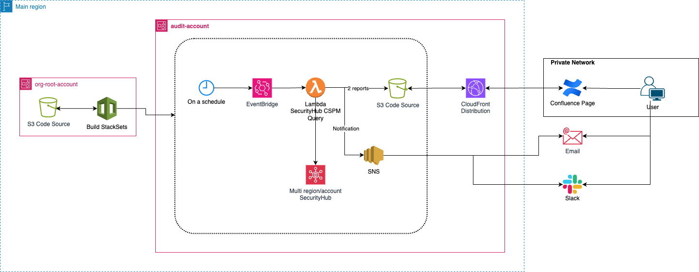

# AWS SecurityHub CSPM Report
Automatically publish SecurityHub CSPM findings for collaboration in a human-readable format.

## Table of contents
- [AWS SecurityHub CSPM Report](#aws-securityhub-cspm-report)
  - [Table of contents](#table-of-contents)
  - [Intro](#intro)
  - [What it does](#what-it-does)
  - [Design](#design)
    - [Automated](#automated)
    - [Manual](#manual)
  - [Deployment](#deployment)
    - [Manual steps - Prerequisites](#manual-steps---prerequisites)
    - [Automated steps](#automated-steps)
    - [Manual steps - Post-deployment](#manual-steps---post-deployment)
  - [Credits](#credits)

## Intro
This repo aims to automatically publish SecurityHub CSPM findings and make them easily readable via documentation and collaboration platforms (e.g., Confluence). 

## What it does
This CloudFormation template automates the creation of an end-to-end SecurityHub CSPM reporting pipeline.

## Design
Assumptions:
* The design assumes that: 
  * an audit account has been created and configured as delegated administrator for SecurityHub CSPM.
  * SecurityHub CSPM is configured with Cross-Region aggregation.

The design is as it follows:


*Figure 1: SecurityHub CSPM Reports Design*

[Design Source - draw.io](https://github.com/alexbar-hub/aws-securityhub-cspm-report/blob/main/images/aws-securityhub-cspm-reports.drawio)


### Automated
The following resources are created automatically:
* S3 bucket to store all SecurityHub reports, with built-in lifecycle management:
  * Transition objects to Glacier after 90 days
  * Delete incomplete multipart uploads after 7 days
  * Expire and delete objects after 5 years
* Lambda function that extracts SecurityHub findings and saves them to the S3 bucket
* SNS topic with two preconfigured subscriptions for email notifications
* EventBridge rule that triggers the Lambda function on a schedule

After deployment, reports are generated weekly and:
* Saved in the S3 bucket using a timestamped naming convention: `2024-09-26-05:42:12-SecurityHub_Findings.csv`
* A static copy (`SecurityHub_Findings_Latest.csv`) is maintained for access via Confluence through CloudFront
* A message containing the Confluence link is posted automatically to the designated Slack channel

### Manual
Certain actions require manual configuration or setup outside of the CloudFormation template. These will be detailed in the Deployment section.

## Deployment

### Manual steps - Prerequisites
Generate a private/public key pair using OpenSSL and save it somewhere safe:
```bash
openssl genrsa -out custom-name-private_key.pem 2048
openssl rsa -pubout -in custom-name-private_key.pem -out custom-name-public_key.pem
```

In CloudFront:
* create the `custom-name` Public Key importing the public key created above;
* create the `custom-name` Key Group and add the public key created above;
* create the `custom-name` Origin access as it follows:
  * Signing behavior: Sign requests
  * Origin type: S3
* create the `custom-name` Cache Policy with Minimum/Maximum/Default TTL=60
* create a Distribution as it follows:
  * Origin domain: select the bucket created above
  * Origin access: Origin access control settings
  * Origin access control: `custom-name`
  * Viewer protocol policy: Redirect HTTP to HTTPS
  * Restrict viewer access: Yes
    * Trusted authorization type: Trusted key groups
    * Add key groups: `custom-name`
  * Cache policy and origin request policy
    * Cache policy: `custom-name`
  * Web Application Firewall (WAF): Do not enable security protections
  * Click Create Distribution
* Upload the needed objects in the bucket;

Get the arn of the CloudFront distribution.

### Automated steps
Deploy the template, making sure to provide (in addition to the other parameters) the **ARN of the CloudFront distribution** created above. All fields are mandatory.

### Manual steps - Post-deployment
* generate a signed CloudFront URL for the S3 objects as it follows:
  * connect to the root-tmx-audit account via cli

```bash
$ aws cloudfront sign \
>  --url https://something.cloudfront.net/SecurityHub_Findings_Latest.csv \
>  --key-pair-id my-key \
>  --private-key file://custom-name-private_key.pem \
>  --date-less-than 2099-10-19
https://something.cloudfront.net/SecurityHub_Findings_Latest.csv?Expires=4096051200&Signature=something-something-something-something&Key-Pair-Id=my-key

```

* In Confluence, add a **Table from CSV** item, and paste the URL in the CSV URL field.


## Credits
* [Bryan Chua - ykbryan](https://github.com/ykbryan) - Original author of the lambda function that I repurposed, available [here](https://github.com/ykbryan/lambda-get-securityhub-findings).
